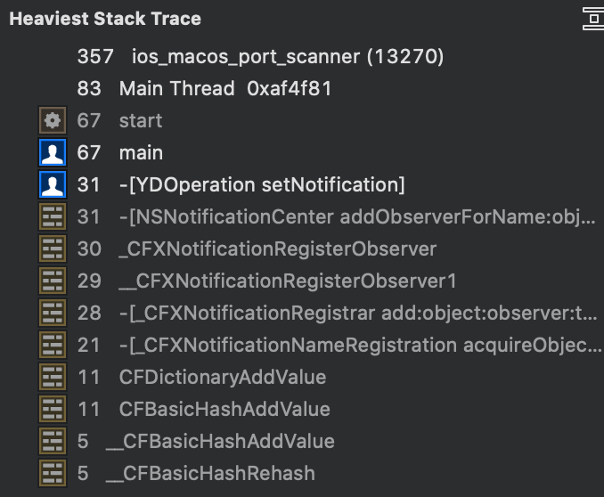
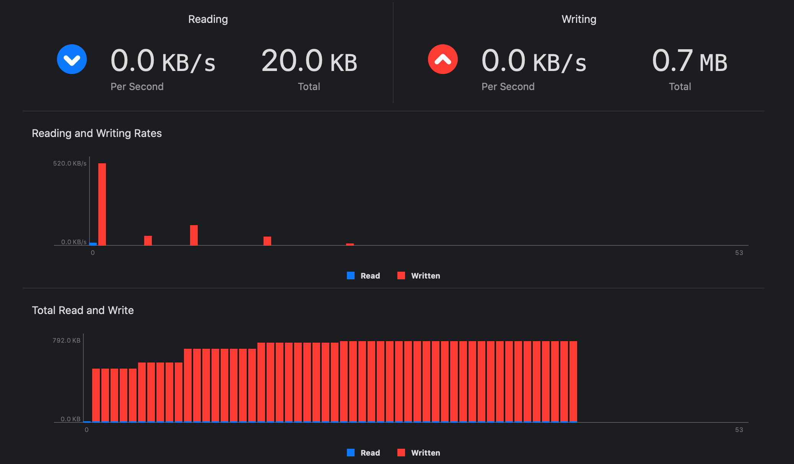

# iOS and macOS Port Scanner
Port Scanner for iOS and macOS

### Speed overview

Language  |Threads |Time | Data structure
--|---|--|--
Objective-C | 5 | 13.5-15 seconds | Queue
Python | 5 |  13.5-15 seconds | Queue
C  | 1 | 13 seconds | Sequential array


### Objective-C and C design choices
I expected the `Objective-C` code to be quick, as it still used `Sockets()` but I was able to leverage:
 - An `operation` represented the smallest unit of work.
 - Create a `Class` that inherits from `NSOperation`.
 - This class had one `Instance Property` for the `socket` check; the `port` number.
 - The class had instance properties related to `Operation`; `BOOL isExecuting, isFinished;`

 - Each `Operation` was added to a single `NSOperationQueue`.
 - The `queue` was setup to be `multi-threaded` by `[queue setMaxConcurrentOperationCount:5];`
 - After each `Operation` is finished, it published a `Notification`.
 - On the `finished notification` the `Port` tested and `Thread ID` were added to an `Array`.  The `usedThreads` array crashed consistently without a `synchronize` wrapper.  `NSMutable Arrays` are not thread safe.  I could have `locked` the `Open Ports` arrays.  But `Open Ports` was so frequently used it never caused `undefined behavior`.

### Results
```
[*]Ports checked:  2000
		hostname:127.0.0.1
[*]main thread:  0x063d09
[*]Threads used:  9
		Thread=0x063e77, Count=285
		Thread=0x063e7b, Count=226
		Thread=0x063e76, Count=222
		Thread=0x063e7a, Count=208
		Thread=0x063e97, Count=132
		Thread=0x063e75, Count=295
		Thread=0x063e79, Count=254
		Thread=0x063e7d, Count=141
		Thread=0x063e78, Count=234
[*]Open ports:  2
		port=22
		port=631

[*]Finished in:  14.131 seconds
```
### Time Profiler
Within `Xcode` select `Product\Profile` to launch `Instruments`. Then select `time profiler`:


This showed the `Heaviest Stack Trace`. Huh.  Something not related to the `port scan`.



### Re-design 1
An obvious improvement was to change the `Notification` to a `Class Function`. It was no longer called many times [ when a new class was created ].


### Re-design 2
There was no immediate evidence of a speed-up.  But, before I look at speed, there were obvious `Objective-C` improvements to make:

Issue  | Description
--|--
Retire `transient` Type |  Replace a `NSMutableArray` that was a "transient" structure to get data into a `NSCountedSet`.
`Properties`|  Replace `Class Properties` to better enforce `encapsulation` [ by hiding more `instance variables` from the calling code.and
`Instance Methods`  |  Replace `getter` and `setter` with `methods`


### Re-design 3

https://google.github.io/styleguide/objcguide.html

https://github.com/raywenderlich/objective-c-style-guide#spacing

My code was not completing.  It was getting stuck on this line:  `[queue waitUntilAllOperationsAreFinished];`

Setting as breakpoint revealed:
```
(lldb) po [queue operationCount]
30
```



### Re-design 4
What about moving the code away from a `Class instance` and move to a `Block`?

### Re-design 5
The `Operations` themselves are `synchronous`. Does that mean it blocks all the other threads?  No. Reference below:

>@property(readonly, getter=isAsynchronous) BOOL asynchronous;
Discussion
NO for operations that run synchronously on the current thread. The default value of this property is NO.


### What about
`NSPort`            ->
`NSStream`          -> complex, when I only want to check whether a `port` is `open`.
`NSSocketPort` -> only available on `macOS`.
`TCP Half Open` scan ( for speed)
`TCP Connect` for complete `TCP connection`
