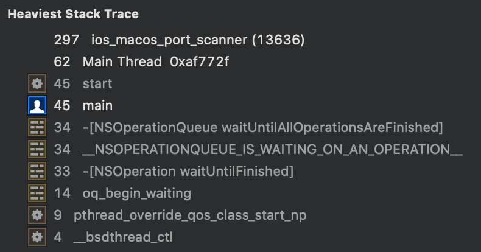

# iOS and macOS Port Scanner
Port Scanner for iOS and macOS

### Speed overview

Language  |Threads |Time | Data structure
--|---|--|--
Objective-C | 5 | 13.5-15 seconds | Queue
Python | 5 |  13.5-15 seconds | Queue
C  | 1 | 13 seconds | Sequential array


### Objective-C and C design choices
I expected the `Objective-C` code to be quick, as it still used `Sockets()` but I was able to leverage:
 - Create a `Class` that inherits from `NSOperation`
 - This class had one `Instance Property` for the `socket` check; the `port` number.
 - The class also had instance properties related to `Operation`; `BOOL isExecuting, isFinished;`

 - An `operation` represents the smallest unit of work
 - Add each `Operation` to a single `NSOperationQueue`
 - The `queue` is setup to be `multi-threaded` by `[queue setMaxConcurrentOperationCount:5];`
 - After each `Operation` is finished, it publishes a `Notification`
 - On the `finished notification` the `Port` tested and `Thread ID` are added to an `Array`.  The `usedThreads` array crashed consistently without the `synchronize` wrapper.
 - I used two `NSMutable Arrays`.  These are not thread safe.  I should also `lock` the `Open Ports` arrays.  But as the calls to the add objects to this array are so seldom, it hasn't impacted the `Port Scanner`.

##### Results
```
[*]Ports to check = 2000 on: 127.0.0.1
[*]Open Ports (
    22,
    631
)
[*]Finished in: 15.104 seconds
[*]Thread=0xae9643, Count=218
[*]Thread=0xae9634, Count=250
[*]Thread=0xae9633, Count=368
[*]Thread=0xae9636, Count=419
[*]Thread=0xae9632, Count=353
[*]Thread=0xae9635, Count=392
```
### Time Profiler
Within `Xcode` select `Product\Profile` to launch `Instruments`. Then select `time profiler`:


This showed the `Heaviest Stack Trace`. Huh.  Something not related to the `port scan`.


### Re-design 2
An obvious improvement was to change the `Notification` to a `Class Function`. It was no longer called many times [ when a new class was created ].



### Re-design 1
As there was no immediate evidence of a speed-up, what about moving the code away from a `Class instance` and move to a block?


### What about
`NSPort`            ->
`NSStream`          -> complex, when I only want to check whether a `port` is `open`.
`NSSocketPort` -> only available on `macOS`.


### Design
`TCP Half Open` scan ( for speed)
`TCP Connect` for complete `TCP connection`
